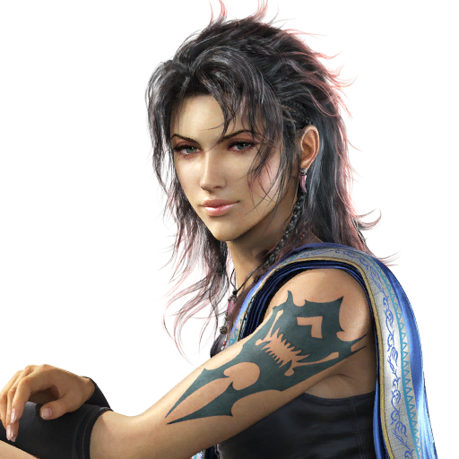

 

This section of the guide covers the Enhancements that can be applied to the game to make it look better.

## Anisotropic filtering

## For Nvidia Card users
- Right click and Open the **Nvidia Control panel**

- Select **Manage 3D settings** and go to the **Program settings** tab in the menu. 
Click on the drop down list at the centre and select **Final Fantasy XIII(ffxiiiimg.exe)**. 

- In the below submenu, select **Anisotropic filtering**, and set the value to whatever you prefer. (x8 or x16 is better) hit apply on the bottom right corner of the control panel.

### For AMD card users
I don't own an AMD card and can only point you to this page on how to get Anisotropic filtering working on your GPU. Follow the Anisotropic filtering section.
 https://www.amd.com/en/support/kb/faq/dh-012#faq-Anisotropic-Filtering

This should give you sharp and good looking textures for this game.

## Downscaling
**Warning**: *GeDoSato is not supported with the FF13 fix and so I am not recommending to use it for this game in this guide.*

Nvidia DSR and AMD VSR does just what GeDoSato does. Unfortunately not all cards support this feature, which is why many still use GeDoSato for older games and for this one as well. I will assume that those playing this game has a modern GPU capable of doing this and won't recommend GeDoSato over the FF13 fix if your card doesn't support DSR or VSR respectively. just play the game with higher AF x16 at your native resolution.

### For Nvidia Card users

First check if your graphic card supports DSR in this webpage:
 https://www.geforce.com/hardware/technology/dsr/supported-gpus?field_gpu_type_value=desktop-gpus

Older laptop dedicated graphic cards with Optimus technology do not support DSR.
You can check if your laptop supports DSR by right clicking on the desktop and opening the Nvidia control panel. then check the left side of the panel and see if you have the Display and Video categories apart from the Manage 3D settings category.

If your graphic card supports DSR then follow these steps.

- Right click and open the **Nvidia Control panel**. 

- Select **Manage 3D settings** and go to the [b]Global settings[/b] tab in the menu. 
Here, scroll down and select **DSR Factors**.

- On selecting it, click on the **Off** button which will bring a small drop down list of resolutions to scale the game up to. 

- I will recommend the 4x one if you are having a 1080p screen. Your choice if you want a lower resolution. after checking it, the **DSR Smoothness** option should be clickable.

- Set the **DSR smoothness** to 0%

- Hit apply at the bottom and wait for the screen to flicker. after the apply and close dialog box disappears, close the Nvidia control panel.

### For AMD card users

I don't own a AMD card, and can only point you to the related page on how to do it. follow the Virtual Super Resolution section and the game exe is the **ffxiiiimg.exe** located in the `FINAL FANTASY XIII\white_data\prog\win\bin` directory.
 https://www.amd.com/en/support/kb/faq/dh-010

### Using DSR / VSR resolution in your game
After enabling DSR for your respective graphic cards, open the FFXiiiLauncher.exe file located in the **FINAL FANTASY XIII** folder. 
This is the same root directory folder where you had deleted the setup.xml file from before to reset the launcher settings. 

- Select the new resolution listed in the screen settings option.

- I had setup 4x more the resolution than my native 1080p resolution to upscale, which is 3840 x 2160 (4k) listed here in the launcher.

- Set Anti aliasing to x2, as it can cause frame dips due to it being at x16 for our DSR resolution.

After you are done setting up in the launcher, tick the checkbox Do not show this Window again, and click on the Start game button.
You will get a small message box telling you how to alter settings again. click on ok and the game will launch.

The game will now look great on your screen due to the increased resolution boost provided by DSR / VSR.
