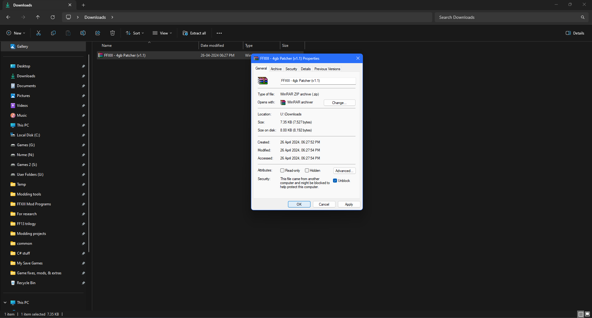

This section would ensure that you are all quickly set up to have an decent playable experience. After following the steps in this section, you should be good enough to properly play the game from start to finish without facing any technical issues.

## The FF13 fix
Most of the technical problems can be solved with this fan made fix made by rebtd7. thank you so much for this fix if you are reading this guide **rebtd7**.

- Download the latest version of the fix from their github releases page:
 https://github.com/rebtd7/FF13Fix/releases

- After the file is downloaded right-click on the file and extract it with WinRAR software's Extract Here option.
  
 You can see the below image for reference:

 If you are using 7Zip software then right click, select 7Zip and the Extract Here option.
 You can once again see the image for reference:

 

- Go into the extracted FF13Fix_164 folder, and select all of the files inside it. right click and select Copy.
  

 

We will now have to copy these files to the location where the game's main executable file is present. the location is give below:
 ``steamapps\common\FINAL FANTASY XIII\white_data\prog\win\bin``

To get to this location first select this game title on your Steam library, right click and select Properties. then in the new window go to **LOCAL FILES** and select the *Browse...* option.

This should open the root directory from where you can get to the **bin** sub folder where the main executable file is present.

You can now follow the screenshots linked below to get to the bin folder and paste the files there.

- Open the **white_data** folder
  

- Open the **prog** folder
  

- Open the **win** folder
  

- Open the **bin** folder
  

- Right click and select the Paste option here. that should copy the fix's files in here and it should look like this after copying the files:
  

And that's it.

If you want to turn off vibration, decrease the vibration strength (max 2.0) or cap your frame limit to 30 or 60, then you can do all of this by editing the values in the FF13Fix.ini file that you copied here.
There's information provided in the ini file itself on what values to edit and what to change, so please follow that correctly if you want to make any changes.

If you are using an AMD RDNA GPU, you can set this **DiscardUIVertexBuffer** option to true and see if it improves the performance a bit.
Be warned that this particular option is still experimental and if its causing any graphical issues in game, then set it back to **false**.

 

## Crash Fix
The game allocates just 2gb of virtual memory when running on a modern x64 PC and if it exceeds that 2gb limit, it starts to crash.

This 4gb patch by Daniel Pistelli increases the virtual memory limit that the game has to 4gb thereby preventing preventing the crashes from occurring. thank you **Daniel Pistelli** if you are reading this guide.

This game unfortunately has an additional DRM that prevents the installation of this 4gb patch and so with the help of the FF13Fix, this 4gb patch can now be installed on to the game.

Make sure that you have installed the FF13Fix as it is required by this 4gb patch.

To make sure people are able to install this patch easily, I have made a small app that should patch in the same byte changes as the 4gb patch to the exe file.

- Download the file from here:
 https://mega.nz/file/30JHmb4K#3z5Rnqs0QAsBSxN_TK3MpBbSOR6M1L5fuy_v6yOgROg

- After the file is downloaded right-click on the file and extract it with WinRAR software's Extract Here option.

 You can see the below image for reference:

If you are using 7Zip software then right click, select 7Zip and the Extract Here option.
 You can once again see the image for reference:

 

- Go into the extracted *4gb Patch Installer* folder, and open the *FFXIII4gbPatcher* application file.
  

- On opening this file, an command prompt window will open along with a message box to select the *FFXiiiLauncher.exe* file.
  

- Click OK on the message box and an small locate window should pop up.
 In here, navigate to the **FINAL FANTASY XIII** game folder and double click on the *FFXiiiLauncher.exe* file.

This *FFXiiiLauncher.exe* file is located in the **FINAL FANTASY XIII** game folder. this is the same folder that you had gone through before when installing the *FF13Fix* patch.

- The patching should start as soon as the launcher file is selected and should complete in seconds. once the patching is complete, you will get a message box saying that the patch has installed successfully.

This should fix the crashes.

 

## More Performance stabilization
This is an additional step only for Nvdia Card users which makes sure the game's performance at 60fps is a bit more consistent.

- Right click and Open the Nvidia Control panel.
  

- Select Manage 3D settings and go to the Program settings tab in the menu. click on the drop down list at the center and select *Final Fantasy XIII(ffxiiiimg.exe)*
  
If this game name does not appear on the drop down list, you will have to add it by using the Add option. this option will open the Add window where you have to add the game executable which is the ffxiiiimg.exe file, by using the Browse option and then navigate to the location of the ffxiiiimg.exe file.
 this file is in the same location, where you copied the FF13Fix files which is:
 ``steamapps\common\FINAL FANTASY XIII\white_data\prog\win\bin``

- Scroll down through the set of options in the list and set the Power management mode option, to Prefer Maximum performance.
  

- Click apply at the bottom, wait for the screen to flicker and after the apply and close dialog box disappears, close the Nvidia control panel. this should give you an even better performance.

 

## Abnormal Eyelashes and character hair
**Only if you face this issue, do the following fix steps**

Due to MSAA completely disabled, some of the stuff like eyelashes and hair render very weirdly and it just looks bad. this can happen if Anti aliasing is set to off in your Graphic card control panel settings.

The exe file which is *ffxiii.img.exe* is found in:
 ``steamapps\common\FINAL FANTASY XIII\white_data\prog\win\bin``

### For Nvidia users
- Right click and Open the Nvidia Control panel.
  

- Select Manage 3d settings and go to the Program settings Tab.
  

- In the Program Settings tab, click on the drop down list at the center and select *Final Fantasy XIII(ffxiiiimg.exe)*.
  
If this game name does not appear on the drop down list, you will have to add it by using the *Add option*. this option will open the Add window where you have to add the game executable which is the ffxiiiimg.exe file, by using the Browse option and then navigate to the location of the ffxiiiimg.exe file.
 this file is in the same location, where you copied the FF13Fix files which is:
 ``steamapps\common\FINAL FANTASY XIII\white_data\prog\win\bin``

- Set the Anti-aliasing Mode option to *Application Controlled* from the set of options in the small drop down list.
  

- Click apply at the bottom, wait for the screen to flicker and after the apply and close dialog box disappears, close the Nvidia control panel.

- This should fix the issue. 

### For AMD users
Refer this guide linked below and in the guide, follow the anti aliasing section.
 https://www.amd.com/en/support/kb/faq/dh-012#faq-Accessing-Radeon-Settings-Gaming-Options

Create a custom application profile for this game by adding the game's exe file from from the top right option in the panel.

Set Anti aliasing mode to Use application settings if it was set to any other option.

Apply the settings, and close the panel. doing all of this should fix the issue. 

 

## Fixing the macro blocking like artifacts on character hair
*This issue seems to occur only on certain Nvidia cards. AMD cards may or may not have this issue.*

This issue can be confused with the *Abnormal Eyelashes and character hair* issue that causes glitched out eyelashes and character hair.

When you move the ingame character or the camera, you would notice small squares flash on the hair. it would feel as if its an shimmering effect cause of the jaggies but on closer observation it reveals an entirely different issue.

What's causing the issue here ?
This issue probably occurs due to some of this game's visual elements being stored in a format which does not render properly when the GPU is trying to smooth the jaggies with the MSAA Anti aliasing. disabling MSAA would fix this issue but it would break the whole alpha to coverage graphics technique which the game heavily uses to render the hair and eyelashes for the character models.

Here's a solution to fix this issue without disabling MSAA.

- Download the latest version of Nvidia Profile inspector from the releases page . thanks to **Orbmu2k** for this amazing tool.
 https://github.com/Orbmu2k/nvidiaProfileInspector/releases

- After the zip file is downloaded, extract the file with winrar or 7zip and open the *nvidiaProfileInspector.exe* file. wait for it to quickly finish loading up some stuff.

- This will be the starting window
  

- Now select **Final Fantasy XIII** from the drop down list
  

- In the Anti aliasing fix option, set it to on from off
  

- Now click apply changes on the top right corner and close the tool.

- This should fix the macro blocking issue on the hair.

 

## Crash before playing the first cutscene in Nautilus
The game crashes before the first cutscene in Nautilus when playing in certain resolutions.

Here are the resolutions on which the game crashes:
- 1366x768
- 1600x1050
- 2103x1183
- 2351x1323
- 2715x1527
- 3325x1871

 Before proceeding further to trigger the cutscene, save the game and set the resolution from the game launcher to a resolution that is not there in the above list.
- Launch the game after setting your resolution and play through the cutscene.
- Once the cutscene has finished playing save the game and close it. then set the resolution back to whatever you had set before and continue playing the game.

 

## Closing Notes
Applying all of these important fixes should ensure that you have an optimal and decent playable experience.

You can follow the [Enahncements](https://github.com/Surihix/Fixing-enhancing-Final-Fantasy-XIII/blob/main/docs/enhancements.md) section next to slightly increase the visuals or you can close this guide and have fun playing the game.
