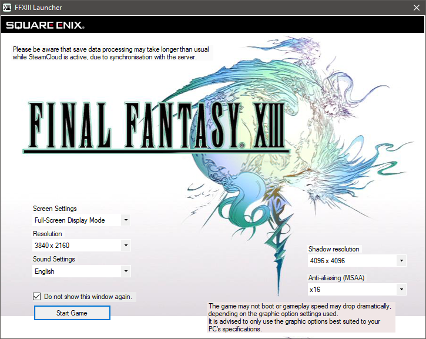
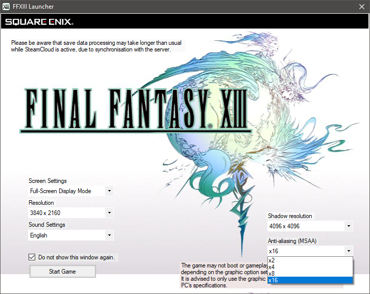
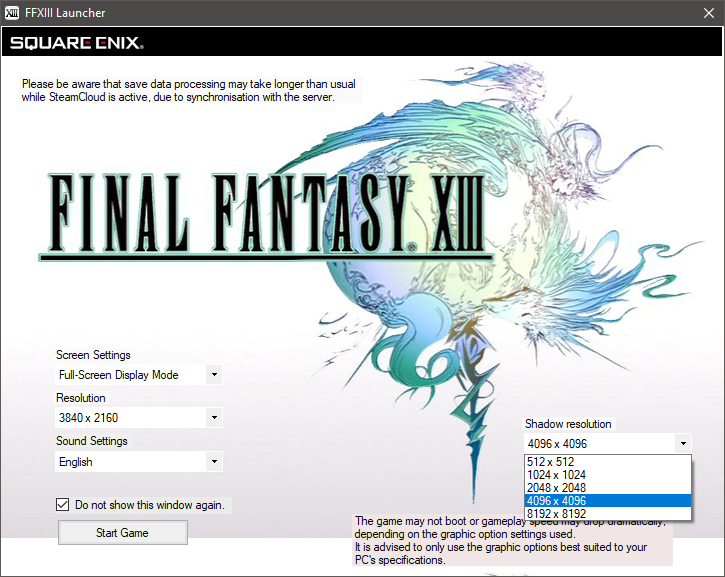

When you launch the game for the first time, there will be a launcher that you can use to customize the visuals, and the audio language.
  

If you want the game to run in fullscreen or windowed mode, then there are options for that in the **Screen settings**. this setting has to be set to **Fullscreen Display Mode** as the windowed mode option limits 
you from customising the resolution.

In the **Resolution settings** tab you can customise the resolution.

In the **Sound settings** tab, you can change the in game voiceovers to either English or Japanese audio. this tab is not available if you have purchased the ASIA region version of the game.
   
Here are some of the important graphical settings that you customize to make the in game visuals look good as well as make the game perform better if you have a low end hardware.
 

**<ins>Anti aliasing</ins>**

The Anti aliasing setting is the least demanding setting in this game. you can set it to a higher value if you are running on your native screen resolution. this option mainly reduces the jagged lines that can be seen on the edges of the ingame 3d models.

*Note: if you intend to follow the DSR method in this guide, then set this to 2x as you will end up hurting performance, if it is set to x16.*
 

**<ins>Shadow resolution</ins>**

Shadow resolution is the setting that you might need to customize a bit for performance reasons.

At lower settings, the shadows will look softer but jagged at the edges with the shadow volume having noticeable artifacts. as you go to higher settings the jagged edges and the artifacts on the shadow volume 
reduces, but the shadow volume starts to look dense making them look quite blocky.

I would suggest setting this to 4096 x 4096. this setting produces shadows that do have jagged edges but thankfully it is not easily noticeable. the benefit with this setting is the somewhat softer and neat 
shadow volume which makes the shadows look a bit better when they are cast on character faces.

**Caution:** if you intend to follow the DSR method in this guide, then set this to 4096 x 4096 itself as the higher 8192 x 8192 setting will end up in lowering the performance drastically.

Once you are done setting up in the launcher, Untick the checkbox that says *Do not show this Window again*, and click on the **Start game** button for a test run.
This is just to see if the game opens correctly and if in case it doesn't open, then skip to the next section of this guide.

If the game opens correctly, then Skip the Intro cutscene by pressing either the **ENTER** key on your keyboard or the **A** or **Cross** button on your controller.

Once you are in the main menu, press the **ESC** key and select the Yes option in the small window with your mouse cursor to close the game.
