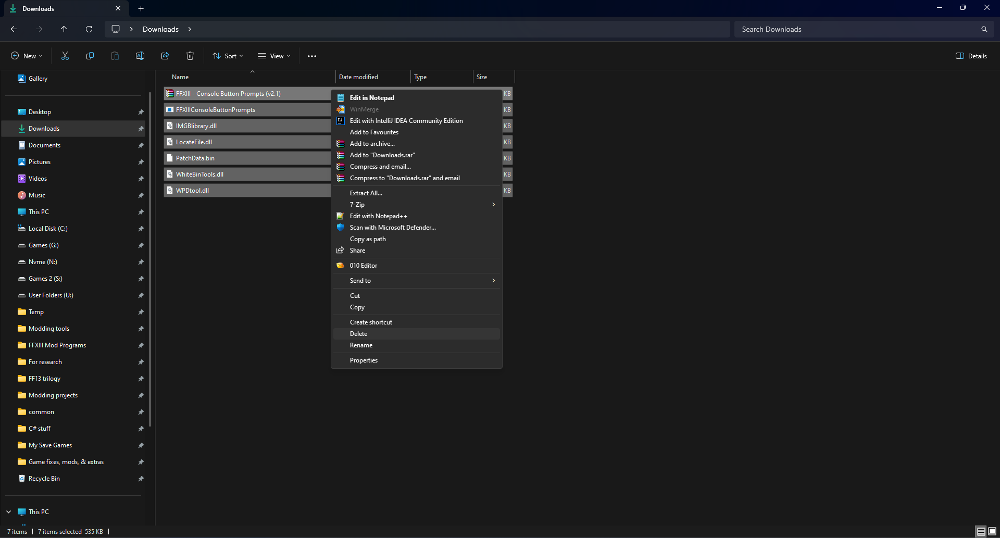

## PS3 and X360 button prompts

The PC version comes with Xbox based button prompts and although the prompts are correct, the icons lack the correct button colors which the 360 version of this game has.
The game also does not come with the Playstation controller icons, which can make it somewhat difficult to play this game if you are playing with a Dualshock controller.

This mod by **Krisan Thyme** comes with the options to install either the proper 360 controller icons or the Playstation 3 icons.

**Compatibility notice:** The mod can be installed via the Nova Chrysalia mod manager. skip this if you want to install mods from both the frameworks as we will be installing the Nova version of this mod.

 

- Download the file *FFXIII - Console Button Prompts (v2.1).zip* from this webpage:
 https://mega.nz/file/q9pjSSDI#K4wFR0XtAY4ql9DrpD1kTMieZU9vnf1ib_Ja_aQfmLE

- Right click on the downloaded zip file and select properties.
 

- Then in the bottom of the properties window, untick the Unblock checkbox and then click on the Ok button.
 

- Now extract this zip file with winrar or 7zip software and you will get these following files
 

- Click on the ***FFXIIIConsoleButtonPrompts*** application file and a program should open along with a message box, prompting you to select the *FFXiiiLauncher.exe* file.
 

- Click Ok on the message box and in the small window that opens, navigate to your game's root directory which is the **FINAL FANTASY XIII** folder. the *FFXiii2Launcher.exe* file is present inside this folder.
 

- After selecting the launcher file in the small window, click on the Open button at the bottom of the window and you will be presented with three options.
 The first two options are for selecting the voiceovers and the last option is for exiting this installer program.
 

- Press the appropriate key that matches the voiceover by which you are playing the game and you will next be prompted with button prompts options.
 

- Press the appropriate key that matches with the button prompts that you want the game to display. pressing either one of the keys, should begin the patching proces and once the mod is done installing, you will be prompted with a message box saying that it has patched the button prompts. click on the Ok button in the message box and that should close the program.

- Now in the folder where you had extracted the zip file, select all of the extracted files, then right click and select the delete option.
 

 

## HD Models Plus

This mod by **MJB**, replaces the default low poly 3D character models used in the game with higher poly models.

**Compatibility notice:** The mod can be installed via Nova Chrysalia mod manager. skip this if you want to install mods from both the frameworks as we will be installing the Nova version of this mod.

 

You can download the mod from this page below and in the Files section as well as read more about the mod in the description page.
 https://www.nexusmods.com/finalfantasy13/mods/11

The instructions for installing this mod are provided in the mod page by the mod author. 

Install this mod separately after installing the [FFXIII HD Project mod](https://github.com/Surihix/Fixing-enhancing-Final-Fantasy-XIII/blob/main/docs/non_nova_mods.md#the-ffxiii-hd-project). once again make sure that you have installed the [Crash Fix](https://github.com/Surihix/Fixing-enhancing-Final-Fantasy-XIII/blob/main/docs/important_fixes.md#crash-fix) patch before installing this mod.

 

## Better Quality audio for Pre rendered movies
This is a mod I made that replaces the lower quality audio tracks of the PC version's pre-rendered movie files with better quality audio files from the PS3 version.

**Compatibility notice:** The mod can be installed via Nova Chrysalia mod manager. skip this if you want to install mods from both the frameworks as we will be installing the Nova version of this mod.

 

**Warning:** If you are going to install the [4k Pre-rendered Cutscenes with Higher Quality audio v2.0](https://github.com/Surihix/Fixing-enhancing-Final-Fantasy-XIII/blob/main/docs/mods_for_both_frameworks.md#4k-pre-rendered-cutscenes-with-higher-quality-audio-v20) mod, then do not install this mod.

You can download the mod from the link below and from the Files section.
 https://www.nexusmods.com/finalfantasy13/mods/34

The instructions for installing this mod is provided in the mod's description page. please follow the **Packed IMG installation method** to install this mod. 

 

## 4k Pre-rendered Cutscenes with Higher Quality audio v2.0

This mod by **No_One✔**, replaces the lower resolution FMVs or the pre rendered cutscenes that the PC version of this game comes by default with much AI upscaled 4k resolution cutscenes.

**Compatibility notice:** The mod can be installed via Nova Chrysalia mod manager. skip this if you want to install mods from both the frameworks as we will be installing the Nova version of this mod.

 

This mod is available only for English voice overs and is still being worked on. it requires a lot of free space more than the Full HD mod and its recommended to download this only when you are sure that you have enough space on the drive on which you have the game installed.

You can download the mod from this page below and in the Files section as well as read more about the mod in the description page. 
 https://www.nexusmods.com/finalfantasy13/mods/24

Make sure to download the files marked with version 2.0 or above and the **4k Movie Installer** file. after downloading the FMV files, follow the **Installing using 4K Movie Installer [for v2.0+\Packed Files Only]** instructions from the mod's description page to install this mod. 

 

## Change Victory Fanfare

This mod allows you to change the default victory fanfare to a select list of fanfare from other FINAL FANTASY games. 

**Compatibility notice:** The mod can be installed via the Nova Chrysalia mod manager. skip installing this mod now if you want to install mods from both the frameworks as we will be installing the Nova version of this mod.

 

https://www.nexusmods.com/finalfantasy13/mods/32

The instructions for installing this mod is provided in the mod page.
