# Nova modding framework

## Important 4gb Patch Clean Up

To use the Nova modding framework, we will have to remove the Crash Fix patch that we applied to our executable from before.

So when installing the crash fix patch, I mentioned to move the 4gb patcher files to a different folder if you are gonna be using the Nova modding framework. lets now open the patcher program again.

If you have deleted the patcher files, then you can re download the file from the link present in the [Crash Fix section](important_fixes.md#crash-fix), and follow the same steps given there till the launcher file selection part.

- Now after selecting the launcher file in the small window, click on the Open button at the bottom of the window and you will be presented with three options.
 The first two options are for installing or removing the patch, while the last option is for exiting this installer program.
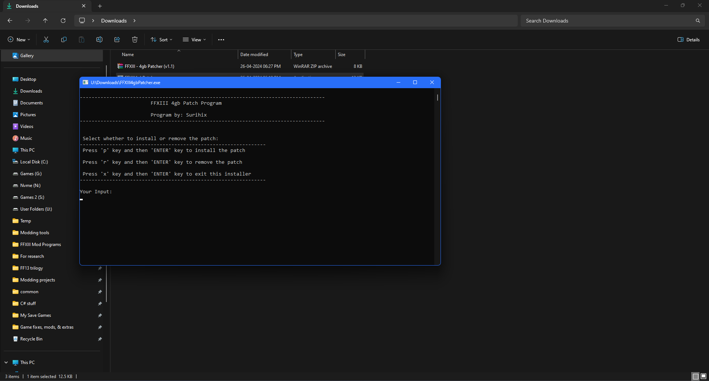

- Press the 'r' key and the removing process will begin. when the patch is removed, you will be prompted with a message box saying that it has finished removing the patch. click on the Ok button in the message box and that should close the program.

- Now in the folder where you have extracted the zip file, select all of the extracted files, then right click and select the delete option.
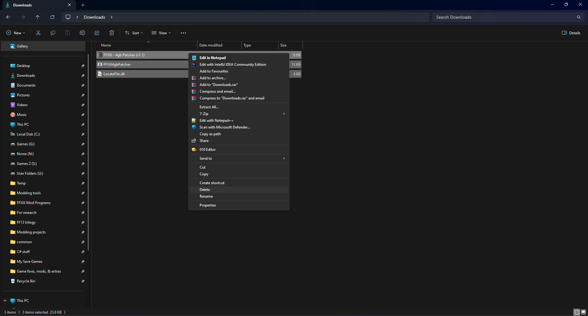

And that's it. you can now proceed to the next section.

 

## Setting up Nova Mod manager

You will have to join the **Fabula Nova Crystallis Modding Community** discord server to download the Nova Chrysalia mod manager program.

Here is a invite link for the server:
 https://discord.gg/NZzNVesvsB

The link for the mod manager download will be in the latest message in the **# announcements** channel on the server. 

- Click on the link under the text **Nova Chrysalia** and that should take you to another site from where you have to download a zip file.
 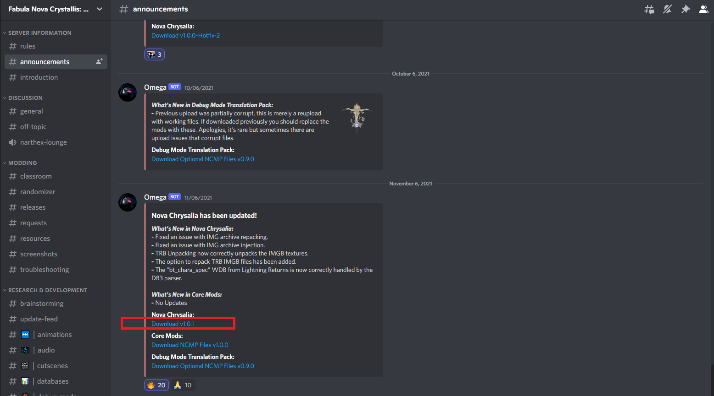

- Extract the zip file that you downloaded with WinRAR or 7Zip software and make sure to select the Extract to Nova Chrysalia 1.0.1 option.
 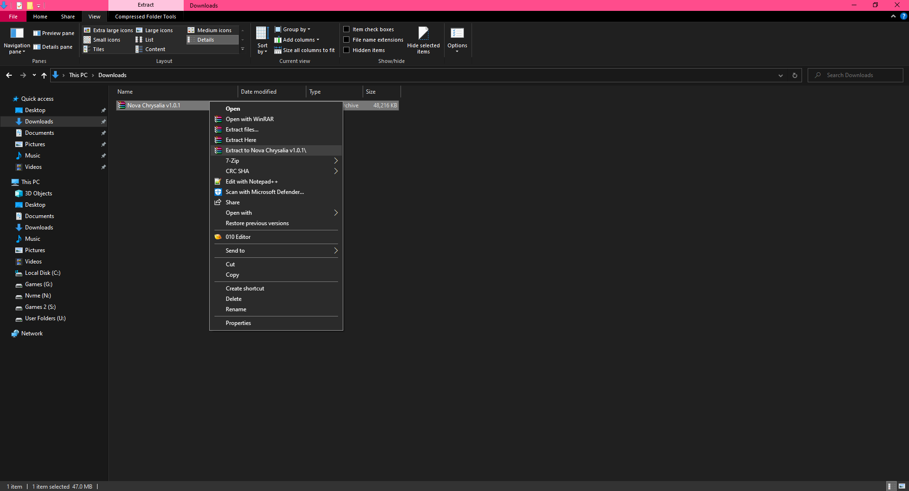

- After the extraction is done, right click on the extracted folder and select Cut.
 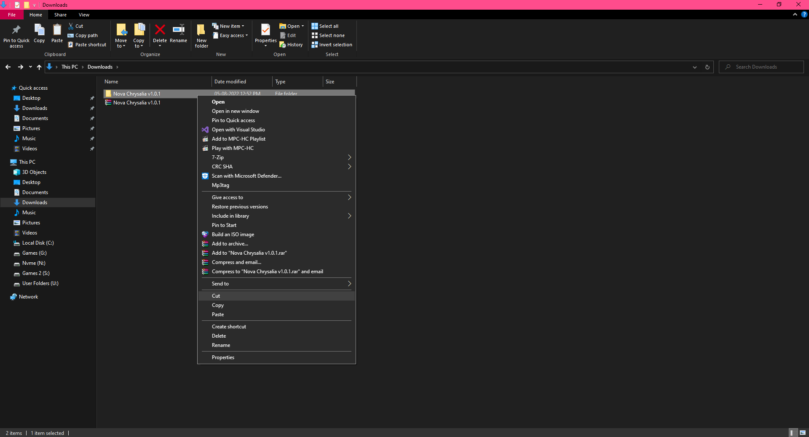

- Go the same drive where you have the game installed and in there right click and select Paste. this will paste the Nova Chrysalia folder in the drive or folder. 
 Since I have the game installed on drive S: I pasted the folder in this drive.
 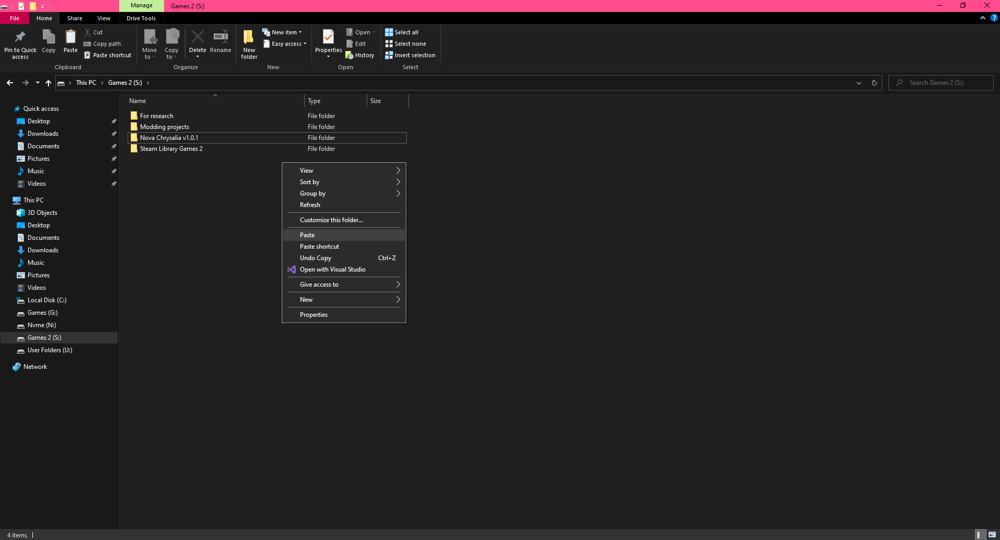

- Click on the ***NovaChrysalia*** application file and this should open the Mod manager.
 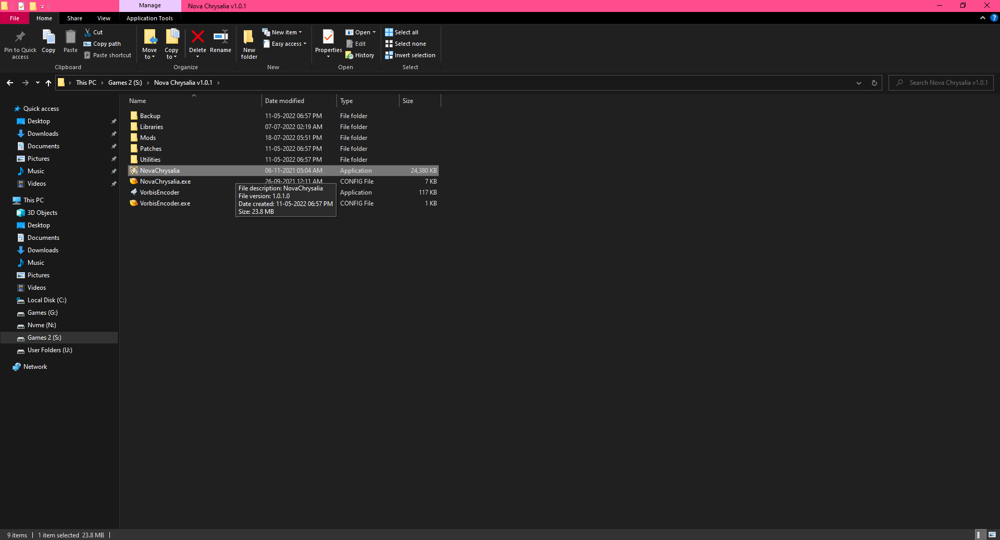

- This is how the Mod manager will look when you open it the first time.
 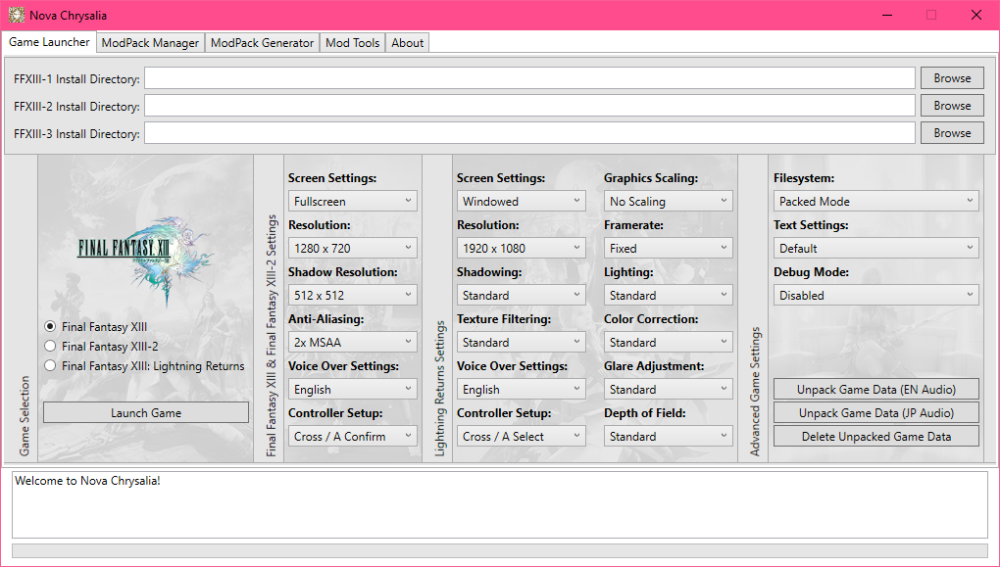

**IMPORTANT:** Under any circumstances, do not launch the game now through the mod manager. we will launch the game after we are done reading the Unpacking sections in this guide.

 

- Set the Install directory for the games that you own by clicking on the Browse button and navigate to the respective game's directory or the root folder. 
For this game it's XIII-1 and the install directory will be the **FINAL FANTASY XIII** root folder.

- Once you have located the folder in the small navigation window, click on it and then click the Select folder option in the navigation window.
 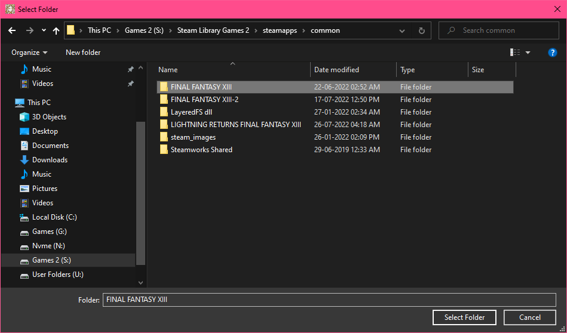

- In the Final Fantasy XIII and Final Fantasy XIII-2 settings row, customize the graphic settings for your game as well as the Voice over settings too. 
 If you have the ASIA/JP region of the game with only Japanese voiceovers, then set the voice over settings to Japanese.
 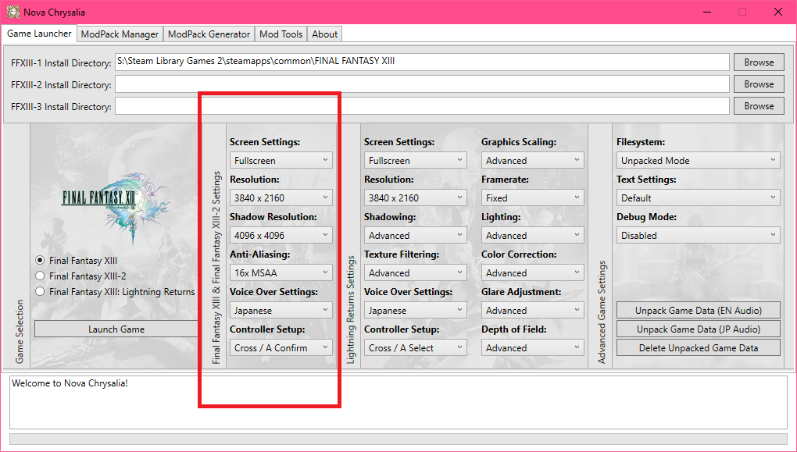

- Then in the last row, set the Filesystem to Unpacked mode.
 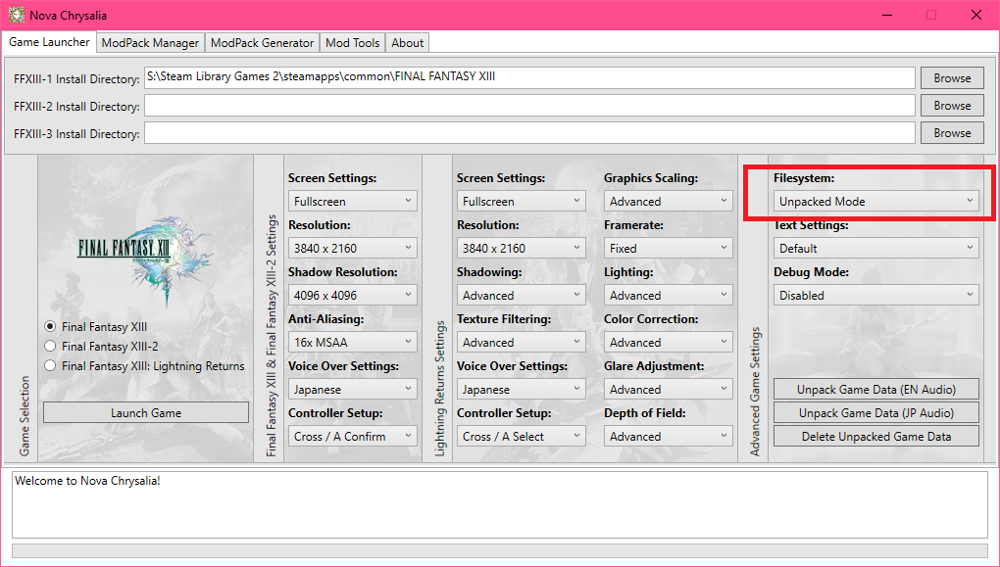

We will need to unpack the game's files to use mods from the nova framework and this unpacking will require some free space in the drive where you have the game installed. 
 For XIII-1, you will need about 110gb of free space and this is including both the voiceover data. If you are going to unpack only for a single language option like only for English Audio, then the size is going to be reduced and be around 60gb.

 

## Unpacking steps (for Nova framework):

These set of steps are only for those who are exclusively using the Nova framework for all of the mods. **DO NOT** follow this if you had installed mods from the other two frameworks.
 
- In the same row where you had set the Filesystem mode, you will see two options **Unpack Game Data (EN Audio)** and **Unpack Game Data (JP Audio)**.
 /nova-img10.png)

If you are playing with English voice overs, then click on **Unpack Game Data (EN Audio)** option. 

Or

If you are playing with Japanese voice overs or have the ASIA/JP region version of the game, then click on **Unpack Game Data (JP Audio)** option.

On clicking either of the options, an prompt will pop up with a Yes or No options. click on the Yes option and the unpacking process will start. this process will take some time to complete and once the unpacking process is complete, an prompt will pop up saying its done unpacking. click on the Ok button to close this prompt.

Click on the Launch game option from the mod manager and if the game launches and functions till the main menu properly, then we are all set to install Nova mods to our game now. 

You can exit the game now and proceed to the [Installing Nova mods](https://github.com/Surihix/Fixing-enhancing-Final-Fantasy-XIII/blob/main/docs/nova_mods.md) section in this guide.

 

## Unpacking Steps (for installing mods from both frameworks)

This small transition program linked below should help in properly unpacking the game data that has all non nova mods installed to the files. by unpacking the game data with this script, you will be able to use mods made for the Nova modding framework along with non nova framework mods as well.

This means you can use mods like **The FFXIII HD Project**, **FFXIII HD Full Motion Video**, **Gameplay Tweaks and Hard Mode**, etc along with Nova framework mods.

- Download the file ***13-1 Unpack GameData script_v1.3.7z*** from here:
 https://mega.nz/file/P4AmUZpa#4siTdztwhvFtPZuBB0gJ7Ze9uz-pusMXE033iyrkUDQ

- Right click on the downloaded 7z file and select properties.
 /upk-game_1.png)

- Then in the bottom of the properties window, untick the Unblock checkbox and then click on the Ok button.
 /upk-game_2.png)

- Now extract this zip file with winrar or 7zip software and you will get this following folder.
 /upk-game_3.png)

- Go into the extracted folder and click on the ***FFXIIINovaTransition*** application file.
 /upk-game_4.png)

- On clicking the application, a program should open along with a message box, prompting you to select the *FFXiiiLauncher.exe* file.
  /upk-game_5.png)

- Click Ok on the message box and in the small window that opens, navigate to your game's root directory which is the **FINAL FANTASY XIII** folder. the *FFXiiiLauncher.exe* file is present inside this folder.
 /upk-game_6.png)

- After selecting the launcher file in the small window, click on the Open button at the bottom of the window and you will be presented with three options.
 The first two options are for selecting the voiceovers and the last option is for exiting this installer program.
 /upk-game_7.png)

Press the appropriate key that matches the voiceover by which you are playing the game and the unpacking process will begin. this will take some time to complete depending on your disk speed and during this process, please make sure that you do not interfere with any of the files on the drive where the game is installed.

Once the process is done, you will be prompted with a message box stating the following:
 *Finished unpacking game data and movie data. Transition is complete.*

- Now in the folder where you had extracted the 7z file, select the extracted folder, then right click and select the delete option.
 /upk-game_8.png)

You can now proceed to the [Installing Nova mods](nova_mods.md) section in this guide.

 

[Next section](nova_mods.md)

[Back to Index](index.md)    
