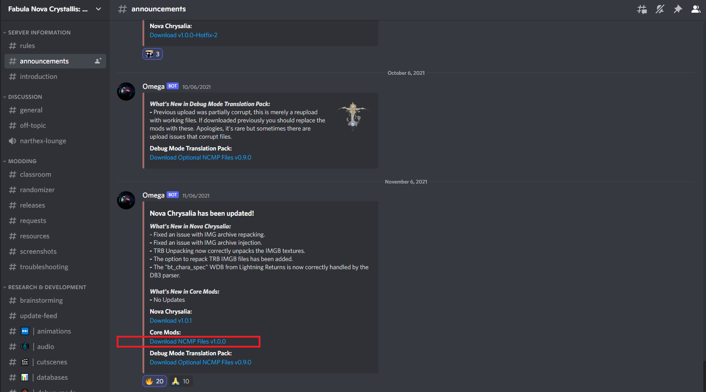
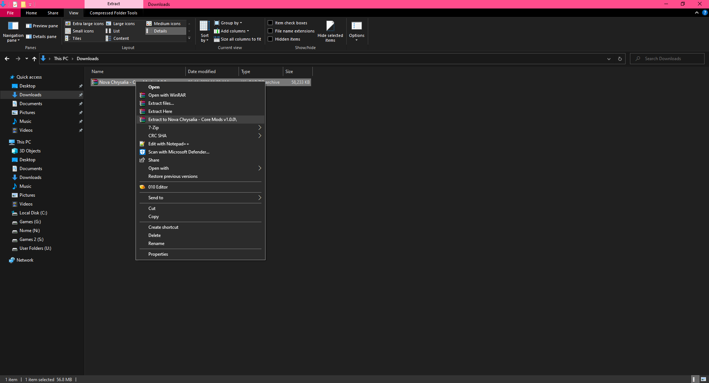
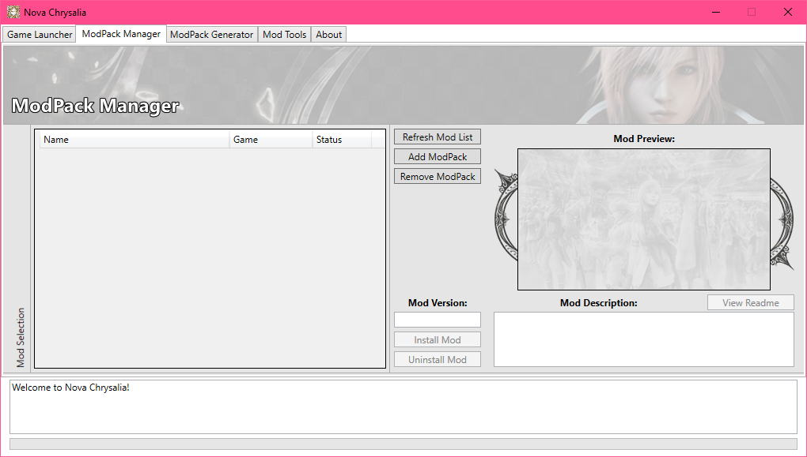
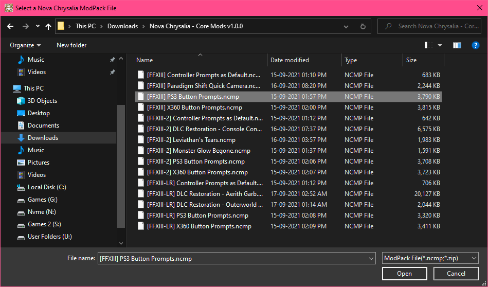
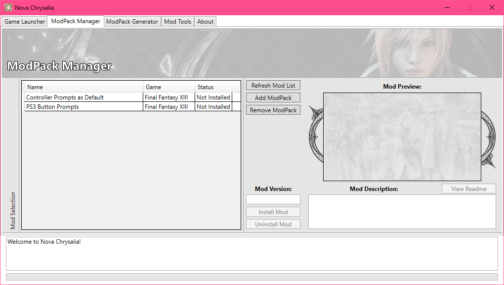
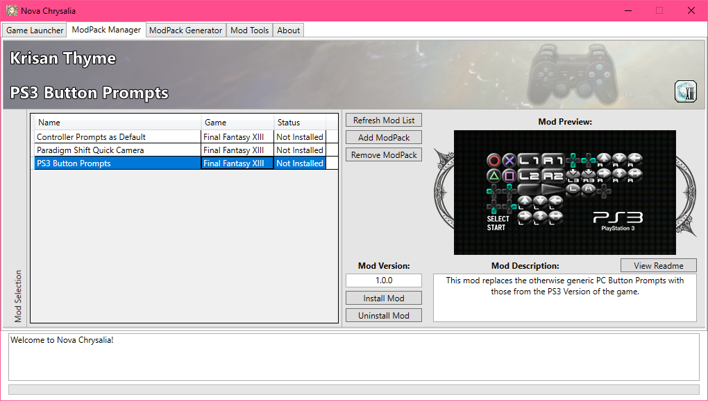

# Installing Nova mods
There are mainly two types of Mods that are made to work with Nova Chrysalia's Unpacked filesystem mode function.

- Mod files that are packed in a .NCMP file format which has to be installed through Nova. this is the format that is used by most of the Nova mods.
And
- Mod files that modifies the unpacked files. the Better Quality FMV audio mod functions by modifying the unpacked files and as of writing this guide is the only mod that works this way.

All of these mods will only work if the game is launched through Nova, with the Filesystem set to Unpacked Mode.

We will first look into installing some of the core mods via Nova mod manager. this installation will give you an idea on how to install NCMP mods via Nova Chrysalia.

 

# Core Mods
This section will include the installation of the PS3 or Xbox 360 Button Prompts mod as well as the Controller Prompts as Default mod.

- From the same **# announcements** channel in the discord server where you had downloaded Nova Chrysalia, click on the link under the text Core Mods and that should take you to another site from where you have to download a zip file.
 

- Extract the zip file that you downloaded with WinRAR or 7Zip software and make sure to select the ``Extract to Nova Chrysalia - Core Mods v1.0.0\`` option.
 

- Now in Nova Chrysalia mod manager, go to the **ModPack Manager** tab.
 

- Click on the **Add ModPack** option and navigate into the folder where you had extracted the Core Mods zip file.

- Once you are inside the extracted Core mods folder, you have to click and add the files that begin with [FFXIII] in the filename. the starting name in the file is used to identify the game name for which the mod is supposed to be installed.

## PS3 / Xbox 360 / Controller Prompt as Default mods
- If you are using a Playstation type controller, then double click on the ***PS3 Button Prompts*** ncmp file as shown in the image.
 Or
 If you are using an Xbox type controller and want coloured button prompts, then double click on the ***X360 Button Prompts*** file.
 

- The mod will be added in the ModPack manager as seen in the image.
 

- I suggest adding the ***Controller Prompts as Default*** mod the same way that you added the PS3 or X360 Button Prompt modpacks.
 

- Now you will have to double click on the mod from this list to select it.
 

- Once you see the preview image of the mod appear on the right side, click on the **Install Mod** option and you will be prompted whether to install the mod or not. Click Yes and wait for the "Installation successful" prompt to appear.
 If that prompt appears then the mod has installed correctly.

- You can now double click and install the ***Controller Prompts as Default mod*** from the mod list, the same way by which you installed the button prompt mod.

- Go back to the **Game Launcher** tab in Nova Chrysalia and launch Final Fantasy XIII via the **Launch Game** option.
Your respective button prompt mod that you installed via the mod manager should now appear in game.

Hopefully with these steps, you should now be able to install any NCMP type mod to your game.

The mods installed through this mod manager will only work if you launch the game via the Mod manager's **Launch Game** option.
if you launch it directly from steam or any other means, then the installed mods will not appear ingame.

## Paradigm Shift Quick Camera
Normally when you initiate a Paradigm Shift for the first time in battle, a long and drawn out
sequence occurs where the camera will pan between party members. every time afterwards the shift sequence is much shorter.

This mod by **Peklo** forces the shorter sequence to always play instead of the longer sequence.

Just like how you installed the Nova version of the PS3 / X360 prompts mod, we need to add the NCMP file into the Nova mod manager with the **Add ModPack** option present in the **ModPack Manager** tab.
 [img]

Once its added into the manager, click on the mod and then click on the **Install Mod** button. this will install the mod to your game.

## 13-1 Randomizer
This mod by **Bartz24**, allows you to randomize certain aspects of this game making it to a bit more interesting than the base game.

**Warning:** The Randomizer is in alpha state and a lot of bugs can occur at any point in the game. this randomizer may or may not be compatible with the Gameplay Tweaks and Hard mode mod. if you have already installed that mod, then do not use this randomizer.

I suggest trying this randomizer only after finishing the base game once or after the main story is done. if you really liked this game and want to replay it with a bit more variety then you can use this randomizer when replaying the game.

Download the randomizer from here:
 https://github.com/Bartz24/FFModdingWPF/releases

Expand the Assets option in the link above and click on the ***FF13Randomizer0.7.6.15.7z***  file. as of writing this guide, the version of the randomizer is 0.7.6.15.

After downloading the file, extract it and you will get few files. open the README.pdf file and follow the instructions in the pdf to setup the randomizer for this game.

## HD Models Plus
From the Files section in the below link, download the files that have *- Nova Chrysalia* at the end of the filenames.

https://www.nexusmods.com/finalfantasy13/mods/11

Extract the zip files after each one is downloaded and you will get NCMP files. you will had to add these NCMP files individually with the **Add ModPack** option present in the **ModPack Manager** tab in the Nova Mod manager.

When you click on the **Install Mod** button, you will get a command prompt window with some options. follow the instructions that is displayed in the command prompt and the mod will be installed to your game.

## Better Quality audio for Pre rendered movies
In the mod page's description, follow the **Nova mod manager Installation method** and go directly to the ***Installing the mod*** portion.

https://www.nexusmods.com/finalfantasy13/mods/34

## 4k Pre-rendered Cutscenes with Higher Quality audio v2.0

**Warning:** This mod will take a lot of space and its recommended to download this only when you are sure that you have enough space on the drive on which you have the game installed.

Download the files marked with version 2.0 or above. there is a optional 60fps cutscene only for the Pre-Credits FMV and you can choose whether to download that one or not based on your preference.

https://www.nexusmods.com/finalfantasy13/mods/24

After downloading each zip file, extract them individually and you will get NCMP files.

You will have to add these NCMP files with the **Add ModPack** option present in the **ModPack Manager** tab in the Nova Mod manager.

Once you add each NCMP file into the manager, you have click on them from the list and then click on the **Install Mod** button. this will install each FMV set remastered by this mod into your game files.
