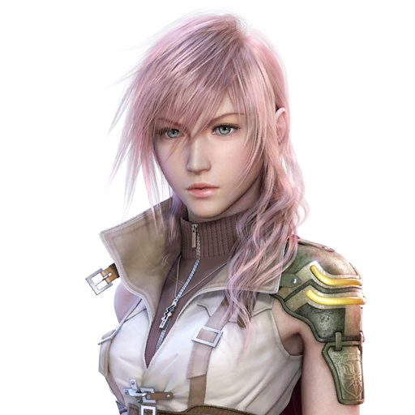

  
Before proceeding with this guide, I recommend to start afresh with a clean game install mostly to avoid issues that can arise with previous mod installs and modifications done to the game files.
  Make sure that you are using the latest version of Windows 10/11 operating system with up to date graphic drivers. once you are sure that everything is up to date, you can proceed to the next step in this guide.
  
## Checking your Installation
I suggest installing the game on a drive that is not the C drive. certain PCs might have restrictions placed on this drive which in turn can prevent some of the patches and mods from not working properly with the game.
  Steam by default will set up a directory in the C drive when you begin installing the game and you will have to change that directory in the installer window to another drive on your PC.
  Now if you had already installed the game on to your C drive, then you can move the game folder to any other drives on your PC with the "_Move install folder_" option.
  You can access this option by right clicking on this game title from the left side of your steam library and selecting "_Properties_". then in the new window that opens, click on the "**LOCAL FILES**" section. the "_Move install folder_" option should be present here.
  If you do not see your drive in the drop down box then you can follow the instructions from this page here:
 https://help.steampowered.com/en/faqs/view/4BD4-4528-6B2E-8327
  
## Verifying Game Integrity
We will use the "_Verify Integrity of game files.._" option to check if all the files are properly downloaded and installed.
  You can access this option by right clicking on this game title from the left side of your steam library and selecting "_Properties_". then in the new window that opens, click on the "**LOCAL FILES**" section. the "_Verify Integrity of game files.._" option should be present here.
  Doing this verification should check your game files and re download only the files that were modified, got corrupt somehow due to download..etc thereby making your game installation proper.
