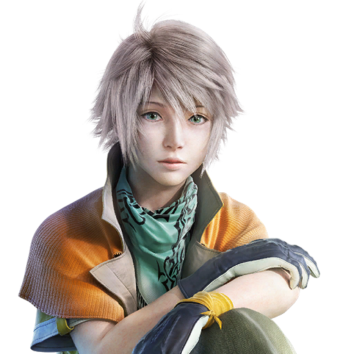

## Severe Problems
* **Inconsistent 60fps**
* **Sudden and unexpected Crashes**
* **Lacks Vibration support that is present in the console versions**
* **Playing at a resolution higher than 1280 x 720 can cause a few issues with scaling of some graphical elements in the game such as:**
    - Portion of enemy intel will be missing in the Libra menu
    - The glowing effect inside the stars when you get five stars in a battle will be missing
    - Animated effects inside all text boxes will be missing
* **Constant Stutters**
* **Macro-blocking like artifacts on character hair**
* **Crash before playing the first cutscene in Nautilus**
* **Abnormal Eyelashes and character hair**
## Non severe Problems
* **Poorly encoded Pre rendered cutscenes, making it slightly inferior compared to the PS3 version**
* **No English audio option for Asia/Japan version of the game**
